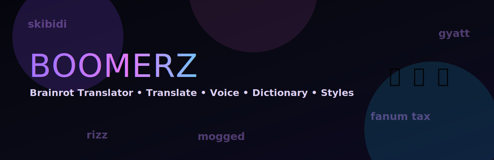

# BOMMERZ - Brainrot Translator



Bommerz is a full-stack translator that converts normal text into brainrot slang and back to human-readable text, with style controls, intensity levels, and voice playback.

## Features

- Bidirectional translation:
  - Normal -> Brainrot
  - Brainrot -> Human
- Styles:
  - Gen Z
  - Sigma
  - NPC
  - Meme overload
- Intensity levels:
  - 1 = Mild
  - 2 = Medium
  - 3 = Cursed
- Voice modes:
  - Crazy (`SOYHLrjzK2X1ezoPC6cr`)
  - Sigma voice (`pNInz6obpgDQGcFmaJgB`)
  - Xomu (`cgSgspJ2msm6clMCkdW9`)
- ElevenLabs voice synthesis with browser TTS fallback
- Dark neon UI with animated rain background

## Tech Stack

- Frontend: React + TypeScript + Vite + Tailwind
- API (local): Express server (`backend/server.js`)
- API (Vercel): Serverless Functions (`api/*.js`)
- AI Provider: OpenAI-compatible API (Groq supported)
- Voice: ElevenLabs API

## Project Layout

```txt
.
|- api/
|  |- _lib/handlers.js
|  |- health.js
|  |- translate.js
|  \- voice.js
|- backend/
|  |- lib/
|  |  |- mockTranslator.js
|  |  \- prompts.js
|  \- server.js
|- public/
|  \- brainrot-banner.svg
|- src/
|  |- data/
|  |  \- voiceModes.ts
|  |- pages/
|  |  |- AboutPage.tsx
|  |  |- DictionaryPage.tsx
|  |  \- StylesPage.tsx
|  |- services/
|  |  \- api.ts
|  |- App.tsx
|  |- index.css
|  \- main.tsx
|- vercel.json
|- package.json
\- vite.config.ts
```

## Environment Variables

Create `.env` for local development:

```env
OPENAI_API_KEY=your_key_here
OPENAI_BASE_URL=https://api.groq.com/openai/v1
OPENAI_MODEL=openai/gpt-oss-120b
OPENAI_MAX_TOKENS=1024
ELEVENLABS_API_KEY=your_elevenlabs_key_here
PORT=8787
```

Notes:
- If `OPENAI_API_KEY` is missing, translation falls back to mock mode.
- `ELEVENLABS_API_KEY` is required for `/voice` synthesis.

## Local Development

1. Install dependencies

```bash
npm install
```

2. Start full local app (frontend + Express backend)

```bash
npm run dev
```

3. Useful local commands

```bash
npm run dev:client   # Vite only
npm run dev:server   # Express only
npm run lint         # Typecheck
npm run build        # Production build
```

## Vercel Deployment

This repo is configured for one-project Vercel deployment.

### How it works

- Vite builds frontend to `dist`.
- Vercel serves API from `api/*.js` serverless handlers.
- Rewrites in `vercel.json` keep frontend API calls unchanged:
  - `/translate` -> `/api/translate`
  - `/voice` -> `/api/voice`
  - `/health` -> `/api/health`

### Deploy Steps

1. Push code to GitHub.
2. Import repo in Vercel.
3. Confirm settings:
   - Build Command: `npm run build`
   - Output Directory: `dist`
4. Add Vercel environment variables:

```env
OPENAI_API_KEY=your_key_here
OPENAI_BASE_URL=https://api.groq.com/openai/v1
OPENAI_MODEL=openai/gpt-oss-120b
OPENAI_MAX_TOKENS=1024
ELEVENLABS_API_KEY=your_elevenlabs_key_here
```

5. Deploy.

### Post-Deploy Smoke Test

- Open `/health` and verify `{ "ok": true, ... }`
- Test translate button in UI
- Test voice button in UI

## API Contract

### `POST /translate`

```json
{
  "inputText": "your text",
  "intensity": 2,
  "style": "Gen Z",
  "mode": "toBrainrot"
}
```

### `POST /voice`

```json
{
  "text": "text to speak",
  "voiceMode": "Crazy"
}
```

### `GET /health`

Returns provider status.
